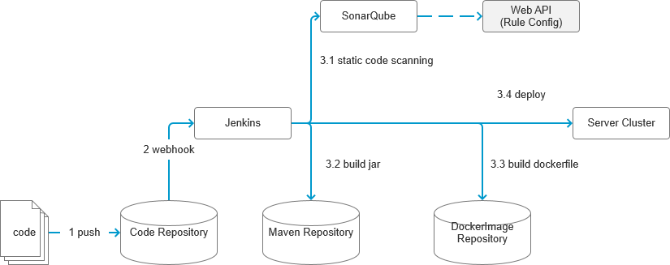

# Sonar Logging Plugin
sonar plugin for scanning with logging standard 


#### CICD pipeline




#### Rule Code

Part of source code for Java rule, some similar way in other languages.

File: $/com/xcom/demo/sonar/logging/checks/XLoggerCheck.java


##### Configuration  

TODO: Get configuration through web API while running 

>1. packageMust: Necessary dependency must be imported, logger/trace (TODO: Need not if no logging)
>2. packageIllegal: Illegal dependency packages 
>3. secrecKeywordsSet: Sensitive words, such as passwords, etc.

```
  // package necessary must be imported
  private Set<String> packageMust = new HashSet<String>(Arrays.asList(
    "com.google.cloud.logging.Logging",
    "com.google.devtools.cloudtrace.v1.Trace"
  ));
  // package illegal must NOT be imported
  private List<String> packageIllegal = new ArrayList<String>(Arrays.asList(
    "org.apache.commons.logging.Log",
    "com.google.api.gax.core.CredentialsProvider"
  ));
  // sensitive keyword
  private Set<String> secrecKeywordsSet = new HashSet<String>(Arrays.asList(
    "Credential",
    "Credentials",
    "secret",
    "secrets",
    "pwd",
    "password",
    "pass",
    "token",
    "credit",
    "mobile",
    "phone"
  ));

```


##### Analyze import statements

> 1. Check if import all necessary dependencies (logging/trace, etc.)
> 2. Check if illegal package dependency are imported
> 3. Cache the info of variable name with its full-type, for example
> { Logging: com.google.cloud.logging.Logging }

```
@Override
public void visitImport(ImportTree tree) {
	...
	
	// package imported and necessary
    if (packageMust.contains(line)) {
      packageChecked.add(line);
    }
    // package imported and illegal
    if (packageIllegal.contains(line)) {
      // ISSUE
      context.reportIssue(this, tree, "Illegal pakcage");
    }
    // simple type with full type
    int posBeforeName = line.lastIndexOf(".");
    String name = line.substring(posBeforeName+1);
    if (StringUtils.isNotEmpty(name)) types2Fullname.putIfAbsent(name, line);
    
    ...
  }
```


##### Analyze variables

> 1. Record all variables with its full-type, for example,
>    { logger: com.google.cloud.logging.Logging }
>
> 2. Based on packageMust, get logger variables and cache them

```
  @Override
  public void visitVariable(VariableTree tree) {
    ...

    // each variables with its full-tpye
    String varName = tree.simpleName().toString();
    String varType = tree.type().toString();
    String varFulltype = types2Fullname.get(varType);
    if (varFulltype == null) varFulltype = varType;
    variables2Fulltype.putIfAbsent(varName, varFulltype);

    // if it is logger variables
    if (packageMust.contains(varFulltype)) {
      variablesLogger.putIfAbsent(varName, varFulltype);
    }

    ...
  }
```


##### Analyze express statements

> 1. Check if the caller variable in the statement is a logger, If yes then:
> 2. Check if  the statement contains sensitive words
> 3. Check if the statement contains keywords such as TraceId (TODO)

```
  @Override
  public void visitExpressionStatement(ExpressionStatementTree tree) {
    ...

    // check if caller is logger
    if (features.size() > 0 && features.containsKey("callers")) {
      Set<String> callers = (Set<String>) features.get("callers");
      boolean isLoggerCaller = false;
      for (String caller : callers) {
        if (variablesLogger.containsKey(caller)) {
          isLoggerCaller = true;
          break;
        }
      }
      // check if the statement contain sensitive word
      boolean isContainSerect = false;
      if (isLoggerCaller) {
        String statement = sb.toString().toLowerCase();
        // check statement if contains secret
        for (String word : secrecKeywordsSet) {
          int posWord = statement.indexOf(word.toLowerCase());
          if (posWord > -1) {
            isContainSerect = true;
            break;
          }
        }
      }
      // create Issue if the statement contain sensitive word
      if (isContainSerect) {
        context.reportIssue(this, tree, "Log content contains secret keyword");
      }
    }

	...
  }
```


#### Debug & Run


##### IDEA UnitTest

> Select com.xcom.demo.sonar.logging.AppTest，Start Debugging through right-click menu 


##### Maven Run

setup in SonarQube

> 1. copy `sonar-logging-plugin-1.0-SNAPSHOT.jar` to /extensions/plugins of SonarQube server
> 2. restart SonarQube

pom.xml of Target Project which to be analyzed

```
<properties>
	...
    <sonar.host.url>{SonarQube Server Url}</sonar.host.url>
    <sonar.inclusions>**/*.java</sonar.inclusions>
    <sonar.projectKey>{Project in SonarQube}</sonar.projectKey>
</properties>
```

SonarQube 9

> mvn clean compile sonar:sonar  -D'sonar.login'=<token>

SonarQube 10

> mvn clean compile sonar:so nar  -D'sonar.token'=<token>


##### Sonar Scanner Run

setup in SonarQube, refer to `Maven Run`

pom.xml of Target Project which to be analyzed, refer to `Maven Run`

SonarQube 9, example

```
sonar-scanner -D'sonar.projectKey'=<sonar_project> -D'sonar.sources'=. -D'sonar.language'=java -D'sonar.java.binaries'=./target/classes -D'sonar.host.url'=<sonarqube_url> -D'sonar.login'=<token>
```

SonarQube 10, example

```
sonar-scanner -D'sonar.projectKey'=<sonar_project> -D'sonar.sources'=. -D'sonar.language'=java -D'sonar.java.binaries'=./target/classes -D'sonar.host.url'=<sonarqube_url> -D'sonar.token'=<token>
```


#### Others


As a suggestion, the company provides a unified logging component, wrap GCP or other logging API, facilitating  the setting and verification of logging standard.


# END
